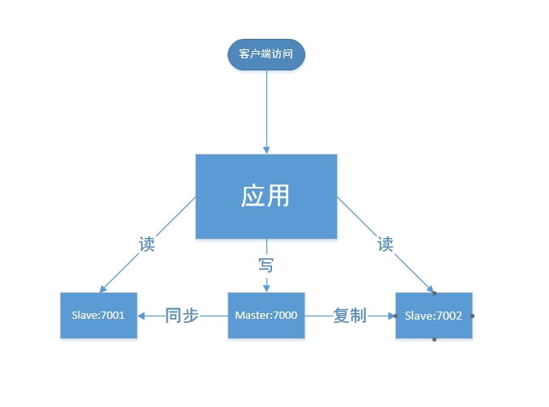
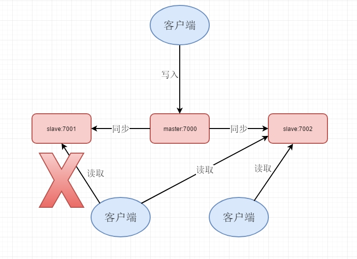
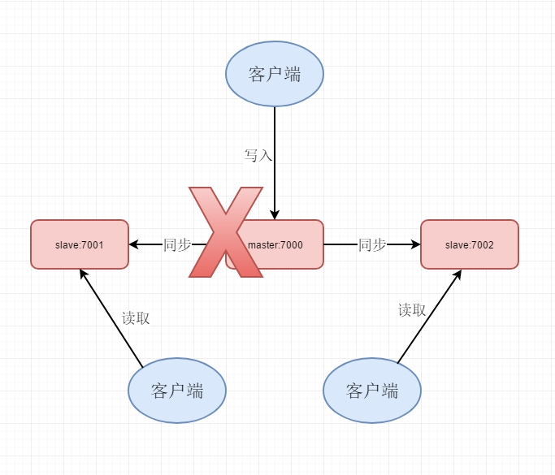
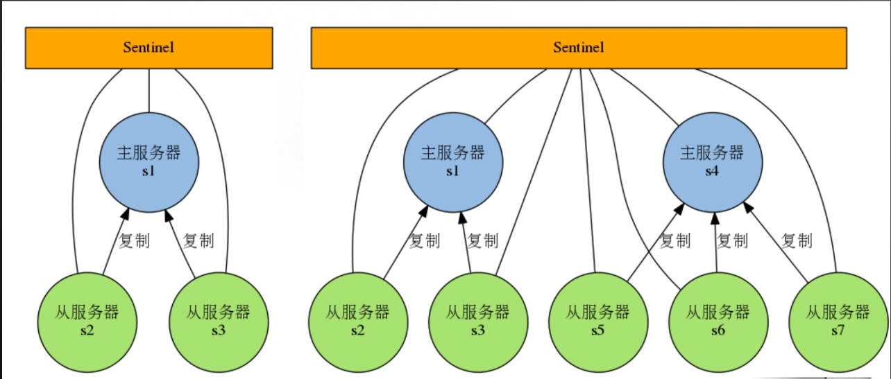
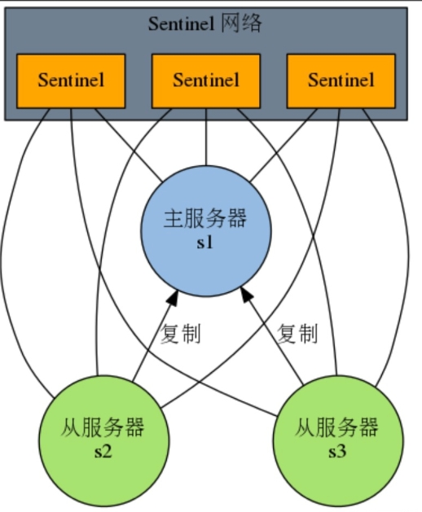

# redis 1主2从 故障转移

- **1主2从搭建**
- **手动故障处理** 
- **redis-sentinel 故障自动转移**


-------------------

[TOC]

### 环境
> 运行环境使用 Nginx + PHP + Redis。
> phpredis 扩展

###  1主2从配置
> redis 在linux 下安装就不说了 
> 直接搭建1主2从
###### 主 7000 .conf 配置
```
bind 127.0.0.1  //绑定
port 7000       // 监听端口
daemonize yes   // 守护进程执行 
pidfile /var/run/redis-7000.pid   // pid
logfile "/usr/local/redis/log/7000.log"  //日志文件
dir "/usr/local/redis/data"            // 工作目录

``` 
###### 从 7001 .conf 配置
```
bind 127.0.0.1
port 7001
daemonize yes
pidfile /var/run/redis-7001.pid
logfile "/usr/local/redis/log/7001.log"
dir "/usr/local/redis/data"
slaveof 127.0.0.1 7000   // 主节点
```

###### 从 7002 .conf 配置
```
bind 127.0.0.1
port 7002
daemonize yes
pidfile /var/run/redis-7002.pid
logfile "/usr/local/redis/log/7002.log"
dir "/usr/local/redis/data"
slaveof 127.0.0.1 7000   // 主节点
```

###### 启动 redis 服务
```
/usr/local/redis/bin/redis-server /usr/local/redis/conf/redis-7000.conf  //主
/usr/local/redis/bin/redis-server /usr/local/redis/conf/redis-7001.conf  // 从
/usr/local/redis/bin/redis-server /usr/local/redis/conf/redis-7002.conf  //从
```

###### 查看服务 是否启动成功
```
[root@VM_0_12_centos conf]# ps -ef |grep redis-server |grep 700
root     23010     1  0 10:56 ?        00:00:05 /usr/local/redis/bin/redis-server 127.0.0.1:7000
root     23016     1  0 10:56 ?        00:00:04 /usr/local/redis/bin/redis-server 127.0.0.1:7001
root     23023     1  0 10:56 ?        00:00:05 /usr/local/redis/bin/redis-server 127.0.0.1:7002
```
* 如果还是不放心的话 可以每个端口都用客户端ping 一下
```
[root@VM_0_12_centos conf]# /usr/local/redis/bin/redis-cli  -p 7000 ping
PONG
[root@VM_0_12_centos conf]# /usr/local/redis/bin/redis-cli  -p 7001 ping
PONG
[root@VM_0_12_centos conf]# /usr/local/redis/bin/redis-cli  -p 7002 ping
PONG
```
* 发现都能ping 同说明是没有问题的
* 分别看下 7000 ，7001，7002 服务的info 信息  验证 7000端口监听的服务 是不是主   7001，7002 监听的是不是从 
 * 7000
```
[root@VM_0_12_centos conf]# /usr/local/redis/bin/redis-cli  -p 7000 info replication
# Replication
role:master   //主节点
connected_slaves:2
slave0:ip=127.0.0.1,port=7001,state=online,offset=933942,lag=1  //从节点
slave1:ip=127.0.0.1,port=7002,state=online,offset=933942,lag=1  //从节点
master_replid:a76b8c7c4c93f741361727fa91b0163347d0b1a1
master_replid2:0000000000000000000000000000000000000000
master_repl_offset:934075
second_repl_offset:-1
repl_backlog_active:1
repl_backlog_size:1048576
repl_backlog_first_byte_offset:1
repl_backlog_histlen:934075

```
  * 7001
```
[root@VM_0_12_centos conf]# /usr/local/redis/bin/redis-cli  -p 7001 info replication
# Replication
role:slave     				//从节点
master_host:127.0.0.1       //监听主节点ip
master_port:7000			//监听主节点端口
master_link_status:up
master_last_io_seconds_ago:1
master_sync_in_progress:0
slave_repl_offset:944386
slave_priority:100
slave_read_only:1
connected_slaves:0
master_replid:a76b8c7c4c93f741361727fa91b0163347d0b1a1
master_replid2:0000000000000000000000000000000000000000
master_repl_offset:944386
second_repl_offset:-1
repl_backlog_active:1
repl_backlog_size:1048576
repl_backlog_first_byte_offset:1
repl_backlog_histlen:944386
```
  * 7002
```
[root@VM_0_12_centos conf]# /usr/local/redis/bin/redis-cli  -p 7002 info replication
# Replication
role:slave     				//从节点
master_host:127.0.0.1       //监听主节点ip
master_port:7000			//监听主节点端口
master_link_status:up
master_last_io_seconds_ago:1
master_sync_in_progress:0
slave_repl_offset:944386
slave_priority:100
slave_read_only:1
connected_slaves:0
master_replid:a76b8c7c4c93f741361727fa91b0163347d0b1a1
master_replid2:0000000000000000000000000000000000000000
master_repl_offset:944386
second_repl_offset:-1
repl_backlog_active:1
repl_backlog_size:1048576
repl_backlog_first_byte_offset:1
repl_backlog_histlen:944386
```   
#####  验证主从
```
[root@VM_0_12_centos conf]# /usr/local/redis/bin/redis-cli -p 7001
127.0.0.1:7001> keys *
(empty list or set)
127.0.0.1:7001> set test 7001 
(error) READONLY You can't write against a read only slave.  //连接从库 set 时报错  说 这是从节点 只能读不能写
127.0.0.1:7001> exit
[root@VM_0_12_centos conf]# /usr/local/redis/bin/redis-cli -p 7000
127.0.0.1:7000> set test 7000
OK
127.0.0.1:7000> get test
"7000"
127.0.0.1:7000> exit
[root@VM_0_12_centos conf]# /usr/local/redis/bin/redis-cli -p 7002
127.0.0.1:7002> get test
"7000"
127.0.0.1:7002> 


```




**########################一条华丽的分割线########################**
#### 一个简单的流程图


###### slave 宕机
* 从节点宕机时 还是比较好处理的  可以先把连接宕机的客户端配置 修改成没有宕机的从节点配置 ，待宕机的从节点修复之后 在把配置文件修改过来



######  master 宕机
* 情景复现 手动kill  主节点进程



```
[root@VM_0_12_centos data]# ps aux|grep redis
root  23010  0.0  0.5 147296  9788 ?   Ssl  10:56   0:23 /usr/local/redis/bin/redis-server 127.0.0.1:7000
root  23016  0.0  0.6 149344 11844 ?   Ssl  10:56   0:21 /usr/local/redis/bin/redis-server 127.0.0.1:7001
root  23023  0.0  0.4 147296  8544 ?   Ssl  10:56   0:22 /usr/local/redis/bin/redis-server 127.0.0.1:7002
[root@VM_0_12_centos data]# kill 23010
[root@VM_0_12_centos data]# ps aux|grep redis
root  23016  0.0  0.6 149344 11844 ?   Ssl  10:56   0:21 /usr/local/redis/bin/redis-server 127.0.0.1:7001
root  23023  0.0  0.4 147296  8572 ?   Ssl  10:56   0:22 /usr/local/redis/bin/redis-server 127.0.0.1:7002

```
* 查看 7001从节点状态
```
[root@VM_0_12_centos conf]# /usr/local/redis/bin/redis-cli -p 7001 info replication
# Replication
role:slave
master_host:127.0.0.1
master_port:7000
master_link_status:down  // 状态已经不是up 了
master_last_io_seconds_ago:-1
master_sync_in_progress:0
slave_repl_offset:4642423
master_link_down_since_seconds:304
slave_priority:100
slave_read_only:1
connected_slaves:0
master_replid:a76b8c7c4c93f741361727fa91b0163347d0b1a1
master_replid2:0000000000000000000000000000000000000000
master_repl_offset:4642423
second_repl_offset:-1
repl_backlog_active:1
repl_backlog_size:1048576
repl_backlog_first_byte_offset:4631530
repl_backlog_histlen:10894
[root@VM_0_12_centos conf]# 
```

- 灾难恢复：
  - 取消slave:7001的同步状态
```
127.0.0.1:7001> slaveof no one
OK
127.0.0.1:7001> info replication
# Replication
role:master   
connected_slaves:0
master_replid:e2666cb03779ae920acf744c29af570331e53001
master_replid2:a76b8c7c4c93f741361727fa91b0163347d0b1a1
master_repl_offset:4642423
second_repl_offset:4642424
repl_backlog_active:1
repl_backlog_size:1048576
repl_backlog_first_byte_offset:4631530
repl_backlog_histlen:10894
```
  - slave:7002 开启同步状态
```
 [root@VM_0_12_centos conf]# /usr/local/redis/bin/redis-cli -p 7002
127.0.0.1:7002> info replication
# Replication
role:slave
master_host:127.0.0.1
master_port:7000
master_link_status:down
master_last_io_seconds_ago:-1
master_sync_in_progress:0
slave_repl_offset:4642423
master_link_down_since_seconds:934
slave_priority:100
slave_read_only:1
connected_slaves:0
master_replid:a76b8c7c4c93f741361727fa91b0163347d0b1a1
master_replid2:0000000000000000000000000000000000000000
master_repl_offset:4642423
second_repl_offset:-1
repl_backlog_active:1
repl_backlog_size:1048576
repl_backlog_first_byte_offset:3593848
repl_backlog_histlen:1048576
127.0.0.1:7002> slaveof 127.0.0.1 7001   //动态修改配置  同步7001端口的主
OK
127.0.0.1:7002> info replication
# Replication
role:slave
master_host:127.0.0.1
master_port:7001    //已经开始监听7001 的主了
master_link_status:up
master_last_io_seconds_ago:1
master_sync_in_progress:0
slave_repl_offset:4642423
slave_priority:100
slave_read_only:1
connected_slaves:0
master_replid:e2666cb03779ae920acf744c29af570331e53001
master_replid2:a76b8c7c4c93f741361727fa91b0163347d0b1a1
master_repl_offset:4642423
second_repl_offset:4642424
repl_backlog_active:1
repl_backlog_size:1048576
repl_backlog_first_byte_offset:3593848
repl_backlog_histlen:1048576
```
* 检验是否修复成功
```
[root@VM_0_12_centos conf]# /usr/local/redis/bin/redis-cli -p 7001 set test 7001
OK
[root@VM_0_12_centos conf]# /usr/local/redis/bin/redis-cli -p 7002 get test 
"7001"
[root@VM_0_12_centos conf]# 

```
* 上述代码 说明我们把7001服务成功由slave节点变成master节点并且7002服务不在同步7000服务 而是同步新的master（7001）服务的数据 
* 主节点的宕机时就麻烦了。需要手动登录服务器去修改
* 在两个从节点上选取一个当主节点，然后把另一个从 同步新的主
* ################ 那怎么实现redis 的自动故障转移呢？#########一条华丽的分割线#### #####
#### redis-sentinel 故障自动转移
*  Redis-Sentinel是Redis官方推荐的高可用性(HA) 解决方案，Redis-sentinel本身也是一个独立运行的进程，它能监控多个master-slave集群，发现master宕机后能进行自动切换。Sentinel可以监视任意多个主服务器（复用），以及主服务器属下的从服务器，并在被监视的主服务器下线时，自动执行故障转移操作。

* 为了防止sentinel的单点故障，可以对sentinel进行集群化，创建多个sentinel。


* redis 还是刚才的 1主（7000） 2从（7001，7002）
##### 搭建redis-sentinel配置
```
root@VM_0_12_centos conf]# cat redis-sentinel-26379.conf 
port 26379
daemonize yes
dir "/usr/local/redis/data"
logfile "/usr/local/redis/log/26379.log"

#监控主节点的名字 ip 端口 2代表 至少有几个sentinel 发现主节点有问题了 开始故障转移
sentinel monitor mymaster 127.0.0.1 7000 2
#监听 3w毫秒 30s有问题之后开始转移
sentinel down-after-milliseconds mymaster 30000 
sentinel parallel-syncs mymaster 1
#故障转移时间
sentinel failover-timeout mymaster 180000 
[root@VM_0_12_centos conf]# sed "s/26379/26380/g" redis-sentinel-26379.conf > redis-sentinel-26380.conf 
[root@VM_0_12_centos conf]# sed "s/26379/26381/g" redis-sentinel-26379.conf > redis-sentinel-26381.conf 

```
#####  启动redis-sentinel服务
```
[root@VM_0_12_centos conf]# /usr/local/redis/bin/redis-sentinel /usr/local/redis/conf/redis-sentinel-26379.conf 
[root@VM_0_12_centos conf]# /usr/local/redis/bin/redis-sentinel /usr/local/redis/conf/redis-sentinel-26380.conf 
[root@VM_0_12_centos conf]# /usr/local/redis/bin/redis-sentinel /usr/local/redis/conf/redis-sentinel-26381.conf 
```
##### 查看redis 服务
```
[root@VM_0_12_centos log]# ps aux|grep redis
root 14971  0.0  0.0 107912   608 pts/0    T    18:52   0:00 cat /usr/local/redis/bin/redis-server /usr/local/redis/conf/redis-7000.conf
root 14984  0.0  0.5 147296  9760 ?  Ssl  18:52   0:01 /usr/local/redis/bin/redis-server 127.0.0.1:7000
root 14989  0.0  0.5 147296  9700 ?  Ssl  18:52   0:01 /usr/local/redis/bin/redis-server 127.0.0.1:7001
root 14996  0.0  0.5 147296  9696 ?  Ssl  18:52   0:00 /usr/local/redis/bin/redis-server 127.0.0.1:7002
root 15925  0.1  0.4 145248  7728 ?  Ssl  19:08   0:00 /usr/local/redis/bin/redis-sentinel *:26379 [sentinel]
root 15932  0.1  0.4 145248  7728 ?  Ssl  19:08   0:00 /usr/local/redis/bin/redis-sentinel *:26380 [sentinel]
root 15937  0.1  0.4 145248  7692 ?  Ssl  19:08   0:00 /usr/local/redis/bin/redis-sentinel *:26381 [sentinel]
```
* 主（7000）;从（7001，7002） redis-sentinel （26379，26380 ，26381 ） 都在正常启动

##### 查看sentinel 服务
```
[root@VM_0_12_centos log]# /usr/local/redis/bin/redis-cli -p 26379 info Sentinel
[root@VM_0_12_centos log]# /usr/local/redis/bin/redis-cli -p 26380 info Sentinel
[root@VM_0_12_centos log]# /usr/local/redis/bin/redis-cli -p 26381 info Sentinel
//结果入下
# Sentinel
sentinel_masters:1
sentinel_tilt:0
sentinel_running_scripts:0
sentinel_scripts_queue_length:0
sentinel_simulate_failure_flags:0
master0:name=mymaster,status=ok,address=127.0.0.1:7000,slaves=2,sentinels=3   //监听主（7000） 和从三个sentinel服务也在互相监听
```

##### master宕机情景复现
* 手动kill master 进程
```
[root@VM_0_12_centos log]# ps aux|grep redis-server
root 14984  0.0  0.5 147296  9760 ?   Ssl  18:52   0:02 /usr/local/redis/bin/redis-server 127.0.0.1:7000
root 14989  0.0  0.5 147296  9700 ?   Ssl  18:52   0:02 /usr/local/redis/bin/redis-server 127.0.0.1:7001
root 14996  0.0  0.5 147296  9696 ?   Ssl  18:52   0:02 /usr/local/redis/bin/redis-server 127.0.0.1:7002
root 17195  0.0  0.0 112648   968 pts/0    S+   19:32   0:00 grep --color=auto redis-server
[root@VM_0_12_centos log]# kill 14984
[root@VM_0_12_centos log]# ps aux|grep redis-server
root     14989  0.0  0.5 147296  9756 ?   Ssl  18:52   0:02 /usr/local/redis/bin/redis-server 127.0.0.1:7001
root     14996  0.0  0.5 147296  9756 ?  Ssl  18:52   0:02 /usr/local/redis/bin/redis-server 127.0.0.1:7002
root     17307  0.0  0.0 112648   964 pts/0    S+   19:35   0:00 grep --color=auto redis-server
[root@VM_0_12_centos log]#
```
#### sentinel服务查看
```
[root@VM_0_12_centos log]# /usr/local/redis/bin/redis-cli -p 26379 info Sentinel
# Sentinel
sentinel_masters:1
sentinel_tilt:0
sentinel_running_scripts:0
sentinel_scripts_queue_length:0
sentinel_simulate_failure_flags:0
master0:name=mymaster,status=ok,address=127.0.0.1:7002,slaves=2,sentinels=3
```
* 已经自动切换到 7002 端口的服务了
##### 查看redis 服务
```
[root@VM_0_12_centos log]# /usr/local/redis/bin/redis-cli -p 7002 info replication
# Replication
role:master
connected_slaves:1
slave0:ip=127.0.0.1,port=7001,state=online,offset=443412,lag=0
master_replid:422f50066944c9ceef580c22890e7302dd324cd2
master_replid2:a2ab16ca68a2fdfe347cb0102484a45d357f9d41
master_repl_offset:443545
second_repl_offset:316396
repl_backlog_active:1
repl_backlog_size:1048576
repl_backlog_first_byte_offset:1
repl_backlog_histlen:443545
[root@VM_0_12_centos log]# /usr/local/redis/bin/redis-cli -p 7001 info replication
# Replication
role:slave
master_host:127.0.0.1
master_port:7002
master_link_status:up
master_last_io_seconds_ago:0
master_sync_in_progress:0
slave_repl_offset:444476
slave_priority:100
slave_read_only:1
connected_slaves:0
master_replid:422f50066944c9ceef580c22890e7302dd324cd2
master_replid2:a2ab16ca68a2fdfe347cb0102484a45d357f9d41
master_repl_offset:444476
second_repl_offset:316396
repl_backlog_active:1
repl_backlog_size:1048576
repl_backlog_first_byte_offset:1
repl_backlog_histlen:444476
[root@VM_0_12_centos log]# 
```
* redis-sentinel 服务已经 自动切换了主从
* 把7002 变成了master   





###三个定时任务

- 每10s 每个sentinel 对master 和slave执行info
    - 发现slave 节点
    - 确认主从关系

- 每2s每个sentinel 通过master 节点的channel交换信息（pus/sub）
    - 通过_sentinel_:hello频道交互
   - 交互对节点的看法和自身信息
- 每1s每个sentinel对其他的sentinel和redis执行ping


